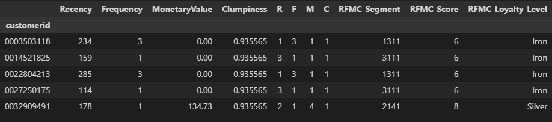
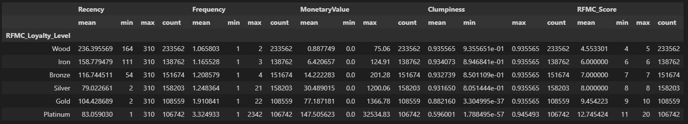

# RFMC_Production_Pipeline

## Overview
This document explains the RFMC (Recency, Frequency, Monetary Value, and Clumpiness) analysis implemented in Python. The analysis segments customers based on their interactions and transactions to categorize them into different loyalty levels. The process includes data extraction, manipulation, calculation of RFMC metrics, and updating a database with the results.

## Results
RFMC metrics and loyalty levels are calculated for each customer. The analysis categorizes customers into loyalty levels: Wood, Iron, Bronze, Silver, Gold, Platinum. The results are stored in a MySQL database for further lookup or analysis.

### Summary Statistics for RFMC Metrics

### Sample of Individual RFMC Analysis Results

## Repository Structure
- `results/`: Contains output data files and result summaries.

## Code Structure

### Section 1: Importing Libraries
- Import necessary libraries and suppress warnings for cleaner output.

### Section 2: Loading and Manipulating Data
- Establish database connection and load data into DataFrame.
- Perform data cleaning, such as converting date columns to datetime objects and sanitizing customer IDs.

### Section 3: Making of RFMC Dataframe
- Calculate Recency, Frequency, and Monetary Value (RFM) for each customer.
- Discretize RFM values to assign scores to each metric.
- Compute Clumpiness based on the distribution of customer transactions over time.
- Merge RFM and Clumpiness data to form the RFMC DataFrame.
- Assign loyalty levels based on RFMC score using quintiles.

### Section 4: Sending Data to Lookup Table
- Connect to the MySQL database.
- Delete existing records in the `rfmc_lookup` table.
- Append RFMC data to the `rfmc_lookup` table in the database.

## Execution Details
- Replace placeholder values in the database connection string with actual credentials.
- The process logs the shape of the loaded data and the time taken for each section of the analysis.

## Results
- RFMC metrics and loyalty levels are calculated for each customer.
- The analysis categorizes customers into loyalty levels: Wood, Iron, Bronze, Silver, Gold, Platinum.
- The results are stored in a MySQL database for further lookup or analysis.

## Notes
- Ensure that the database connection details are secure and not exposed in the code.
- Verify that the `results/` folder is updated with the correct output files after each run.
- Review the discretization thresholds periodically to reflect changes in customer behavior patterns.

## References
- Images `2.png` and `1.png` are graphical representations of the summarized and individual RFMC analysis results, respectively.
